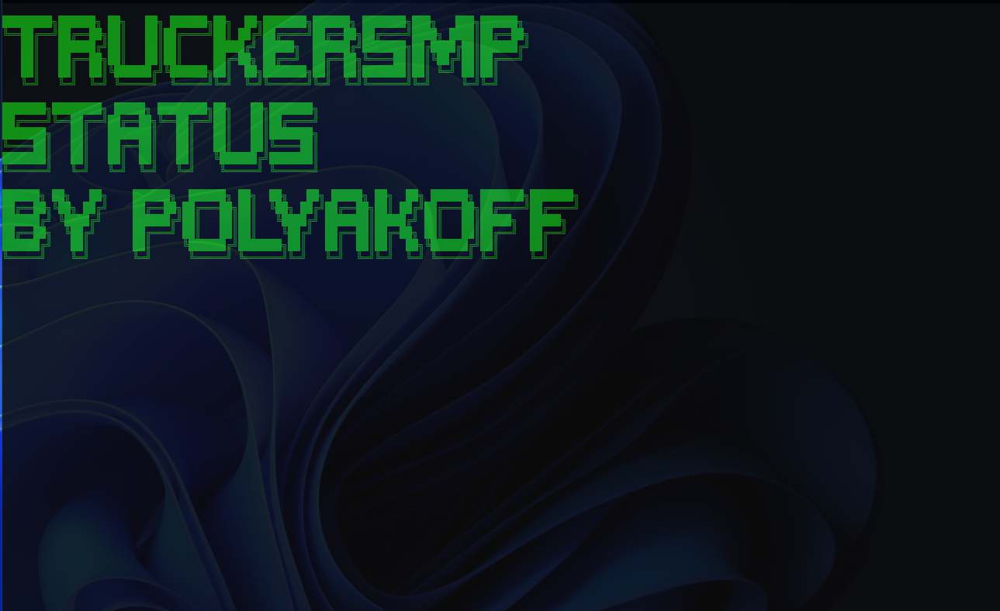
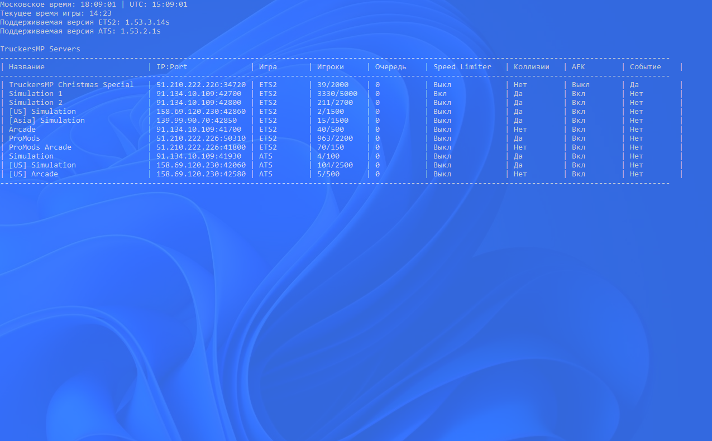

# TruckersMP-Status

**TruckersMP-Status** — это консольное приложение, которое позволяет получать актуальную информацию о серверах [TruckersMP](https://truckersmp.com/) с помощью официального API.

---

## О проекте

**TruckersMP** — это популярный мультиплеерный мод для игр **Euro Truck Simulator 2** и **American Truck Simulator**, который позволяет тысячам игроков по всему миру встречаться и путешествовать вместе по дорогам Европы и Америки.

Мой данный проект разработан для:
- Получения информации о серверах TruckersMP.
- Отображения данных в удобной таблице.
- Вывода текущего времени (Московское и UTC).
- Предоставления данных о поддерживаемых версиях ETS2 и ATS, а также текущем времени игры.

---

## Скриншоты

### Стартовый экран программы


### Стартовый экран программы


### Основной экран программы


---

## Используемые технологии

- Язык: **C#**
- Платформа: **.NET Framework**
- API: [TruckersMP API](https://truckersmp.com/developers/api)

---

## Установка и запуск

### Инструкция по запуску
1. Клонируйте репозиторий:
   ```bash
   git clone https://github.com/GitPolyakoff/truckersmp-status.git
2. Соберите проект в Visual Studio или скачайте готовый исполняемый файл.
3. Перейдите по пути:
    ```bash
    ..\truckersmp-status\truckersmp-status\bin\Debug\
4. Запустите файл `truckersmp-status.exe`.

---

## Полезные ссылки

- [TruckersMP официальный сайт](https://truckersmp.com/)
- [TruckersMP API документация](https://truckersmp.com/developers/api)

---

## Контакты

- **Discord:** [Мой профиль](https://discordapp.com/users/913793634376241192/)
- **Steam:** [Мой профиль](https://steamcommunity.com/profiles/76561199147759312/)

---

### Лицензия

Этот проект распространяется под лицензией MIT. Подробнее см. в файле [LICENSE](LICENSE).
